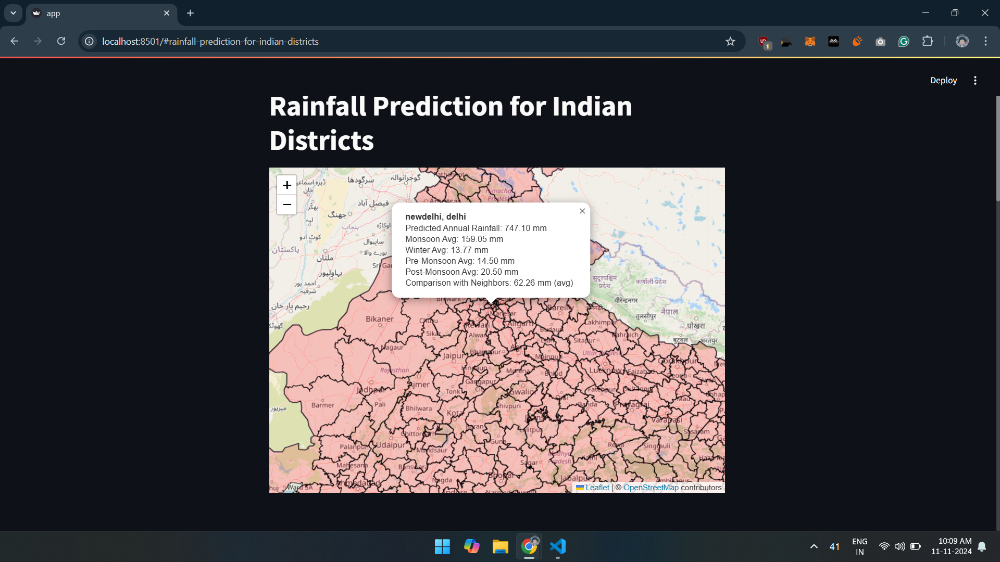

# **Rainfall Prediction using Linear Regression**

This project predicts annual rainfall for districts across India using historical weather data and visualizes the results on an interactive map. By combining machine learning and web integration, the application provides a user-friendly platform for exploring rainfall trends and forecasting.

---

## **Features**
- **Machine Learning Prediction**: Uses a linear regression model trained on historical monthly rainfall data for accurate predictions.
- **Interactive Map**: Visualizes Indian districts, color-coded based on predicted rainfall, with district-specific pop-ups displaying detailed data.
- **Seasonal Averages**: Provides insights into rainfall trends during key seasons (monsoon, winter, etc.).
- **Anomaly Detection**: Highlights districts with rainfall anomalies for better decision-making.
- **User-Friendly Interface**: Built with Streamlit and Folium, offering an intuitive and visually appealing platform.

---

## **Technologies Used**
- **Python**: Core language for development and implementation.
- **Libraries**:  
  - **Pandas**: Data manipulation and preprocessing.  
  - **Scikit-learn**: Machine learning model training and evaluation.  
  - **Joblib**: Model serialization for deployment.  
  - **Folium**: Interactive map visualization.  
  - **Streamlit**: Web interface development.  
  - **Geopandas**: Geospatial data handling.  
  - **Streamlit-Folium**: Integrating Folium maps into the Streamlit app.
  
---

## **Setup and Installation**

1. **Clone the Repository**  
   ```bash
   git clone https://github.com/your_username/rainfall-prediction-app.git
   cd rainfall-prediction-app
   ```

2. **Install Dependencies**  
   Create a virtual environment and install the required libraries:
   ```bash
   python -m venv venv
   source venv/bin/activate   # For Linux/Mac
   venv\Scripts\activate      # For Windows
   pip install -r requirements.txt
   ```

3. **Run the Application**  
   Launch the Streamlit app:
   ```bash
   streamlit run app.py
   ```

4. **Access the Application**  
   Open a browser and go to: `http://localhost:8501`

---

## **Dataset**
- The dataset includes monthly and seasonal rainfall data for over 600 districts in India.
  - [Rainfall in India by Rajanand Ilangovan in kaggle](https://www.kaggle.com/datasets/rajanand/rainfall-in-india)
- Key columns:
  - `STATE_UT_NAME`: Name of the state or union territory.
  - `DISTRICT`: Name of the district.
  - `JAN` - `DEC`: Monthly rainfall values.
  - `ANNUAL`: Total annual rainfall.
  - `Jan-Feb`, `Mar-May`, `Jun-Sep`, `Oct-Dec`: Seasonal rainfall data.

---

## **How It Works**

1. **Data Preprocessing**  
   - The dataset is cleaned, normalized, and aligned with geospatial district boundaries.

2. **Model Training**  
   - A linear regression model is trained using monthly rainfall data as features and annual rainfall as the target.

3. **Prediction**  
   - The model predicts annual rainfall for each district based on input features.

4. **Visualization**  
   - Predictions are visualized on an interactive map, with color-coded districts and detailed data pop-ups.

---

## **Future Enhancements**
- Use advanced models like Random Forest or Neural Networks for improved predictions.
- Include additional climatic variables such as temperature and humidity for richer insights.
- Deploy the app to the cloud for greater scalability and accessibility.

---

## **Contributing**
Contributions are welcome! Please fork the repository, create a feature branch, and submit a pull request.

---

## **Contact**
For questions or suggestions, feel free to contact **Anas Y** at `anasyunusind@gmail.com`.

--- 
